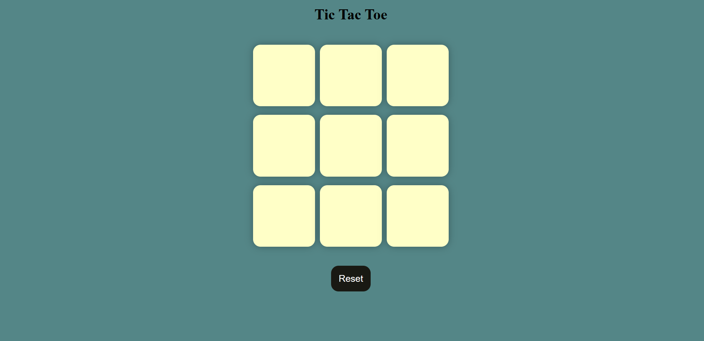

# 🎮 Tic Tac Toe Game

A simple and responsive **Tic Tac Toe** game built using **HTML, CSS, and JavaScript**. This project allows two players to play the classic Tic Tac Toe game in the browser with winner detection, draw detection, and a reset feature.

---

## 🚀 Live Demo

🔗 **Play the Game Here:** https://manjuprasad123.github.io/Tic-Tac-Toe-Game/

---

## 📌 Features

* ✅ Two-player gameplay (X vs O)
* ✅ Automatic winner detection
* ✅ Draw detection when all boxes are filled
* ✅ Reset button to start a new game
* ✅ Responsive design for desktop and mobile
* ✅ Clean and simple user interface

---

## 🛠️ Technologies Used

* **HTML5** – Structure of the game.
* **CSS3** – Styling and responsive layout.
* **JavaScript (ES6)** – Game logic and interactivity.

---

## 📷 Project Preview

> Add a screenshot of your project here.



---

## 📂 Project Structure

```text
tic-tac-toe/
│── index.html      # Main HTML file
│── style.css       # Styling for the game
│── app.js          # Game logic
│── images/         # Screenshots or assets (optional)
│── README.md       # Project documentation
```

---

## 🎯 How to Play

1. Open the game in your browser.
2. Player **O** starts the game.
3. Players take turns placing **O** and **X**.
4. The game automatically checks for:

   * A winner.
   * A draw.
5. Click the **Reset** button to play again.

---

## 🧠 Game Logic

The game checks the following winning combinations:

* Rows
* Columns
* Diagonals

JavaScript compares each winning pattern after every move and displays the winner if a pattern matches.

---

## 📱 Responsive Design

The game uses **CSS Flexbox** and **Viewport Units (vmin)** to automatically adjust the board size on different screen sizes.

---

## 💡 Future Improvements

* 🎨 Dark/Light Mode
* 🤖 Single-player mode with AI
* 🔊 Sound effects
* 🏆 Scoreboard for multiple rounds
* ✨ Winning animation and highlight

---

## 👨‍💻 Author

**Manju Prasad M**

* GitHub: https://github.com/manjuprasad123
* LinkedIn: https://www.linkedin.com/in/manju-prasad-0925a0361/

---

## ⭐ Support

If you like this project, give it a **⭐ Star** on GitHub!

```
```
